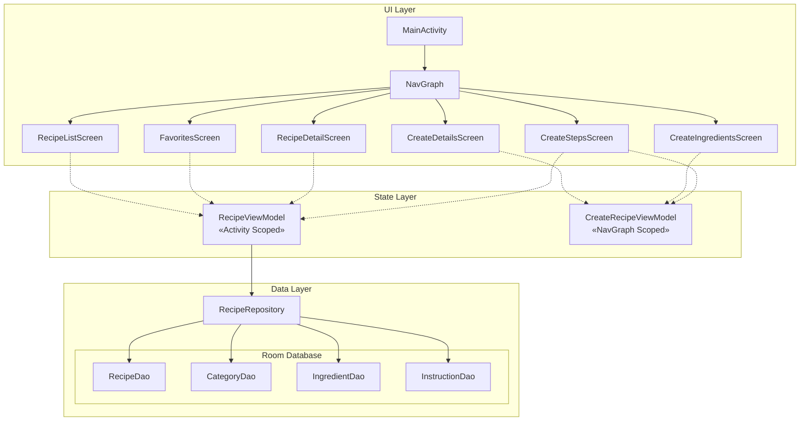
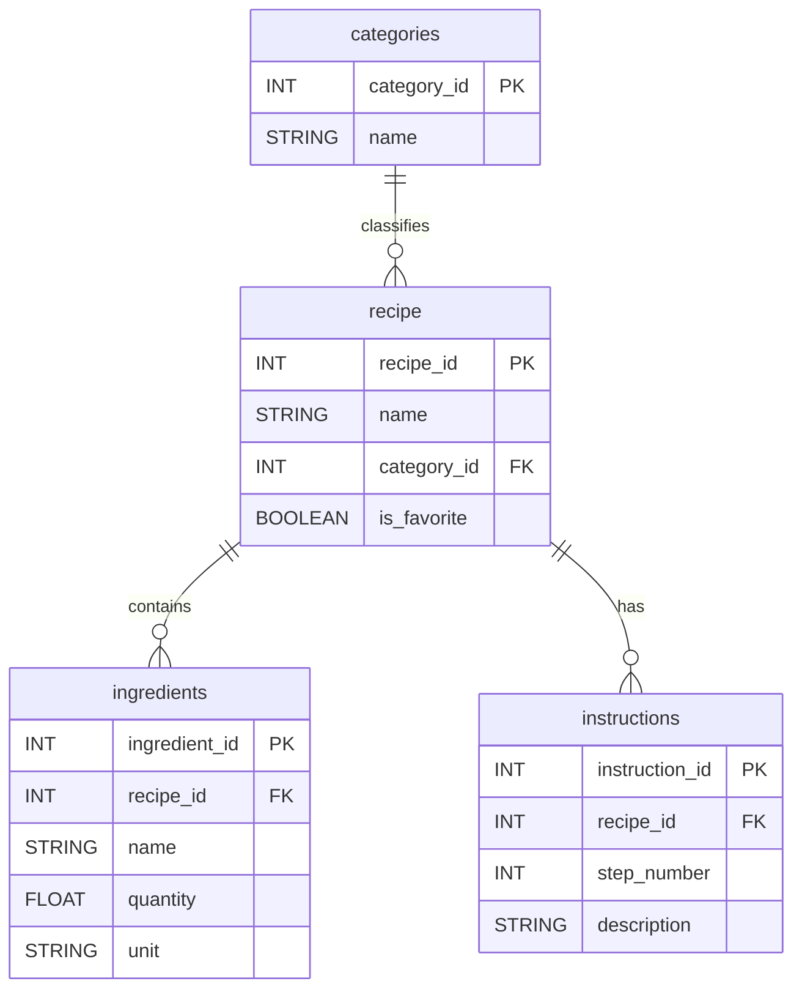
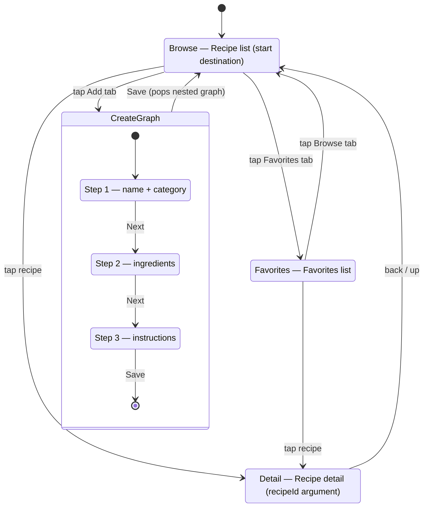

# Ingredients.inc - Recipe App

**Changing the world one bowl at a time**

## App Architecture

### Overview of the App Components

| Component | Type | Function / Purpose |
|-----------|------|-------------------|
| MainActivity | Entry Point | Host for the NavigationSuiteScaffold and NavGraph. Manages the top-level app shell. |
| NavGraph | Navigation | Defines all screen routes and nested graphs. Handles transitions between destinations. |
| RecipeListScreen | UI Screen | Displays recipes grouped by category. Allows quick favorite toggling and navigation to details. |
| FavoritesScreen | UI Screen | Displays a filtered list of recipes that the user has marked as favorites. |
| RecipeDetailScreen | UI Screen | Shows full details of a specific recipe, including ingredients and instructions. |
| CreateDetailsScreen | UI Screen | Step 1 of recipe creation: input name and select category. |
| CreateIngredientsScreen | UI Screen | Step 2 of recipe creation: add/remove ingredients. |
| CreateStepsScreen | UI Screen | Step 3 of recipe creation: add/remove instructions and save the recipe. |
| RecipeViewModel | ViewModel | Activity Scoped. Manages global app state, such as the list of recipes, favorites, and loading specific recipe details. |
| CreateRecipeViewModel | ViewModel | NavGraph Scoped (to CreateGraph). Maintains the temporary state of a new recipe being built across multiple screens. |
| RecipeRepository | Repository | Central point for all data operations. |
| RecipeDao | DAO | Handles CRUD operations for the recipe table, including favorite status. |
| CategoryDao | DAO | Handles CRUD operations for the category table and fetches categories with their associated recipes. |
| IngredientDao | DAO | Manages ingredients associated with specific recipes. |
| InstructionDao | DAO | Manages recipe instructions/steps. |
| RecipesDatabase | Room DB | The underlying SQLite database that persists all app data. |

## Database Schema

We are using 4 tables in this schema: Categories, Recipes, Ingredients and Instructions. The entity relationships are as follow

- Category-recipe: one-to-many    
- Recipe-ingredients: one-to-many
- Recipe-instructions: one-to-many

The following is the Mermaid ER diagram for the Database

## Navigation Graph

The graph has four top-level destinations (Browse, Favorite, and the Create flow) plus a nested navigation graph that organizes the 3-step recipe creation flow. Ingredients and instructions are added by the user on separate screen within the nested graph, and a graph-scoped 'CreateRecipeViewModel' accumulates the in-progress recipe across all 3 screens.

The following Mermaid graph shows a visual version of the graph

### Screens and their functions

**Browse** (`browse`) — The app's start destination. Lists all recipes grouped by category and serves as the entry point to both the recipe detail view and the create flow.

**Favorites** (`favorites`) — Lists only recipes the user has marked as favorite. Tapping any recipe navigates to its detail view. The user can return to the full recipe list at any time using the Browse tab.

**Detail** (`detail/{recipeId}`) — Shows a single recipe's category, ingredients, and instructions. The screen receives the `recipeId` as a navigation argument and supports toggling the recipe's favorite status without deleting the recipe itself.

**Create Recipe — Step 1: Details** (`create/details`) — First step of the nested create flow. Captures the recipe name and category.

**Create Recipe — Step 2: Ingredients** (`create/ingredients`) — Second step of the nested create flow. Captures the ingredient list, where each ingredient has a name, quantity, and unit.

**Create Recipe — Step 3: Instructions** (`create/steps`) — Third step of the nested create flow. Captures cooking instructions, then commits the saved recipe to the database via `RecipeViewModel` and exits the nested graph back to Browse.

The parent route of the nested create flow is `create_graph`. The user enters it by tapping the Add tab and exits it on Save, which pops the entire nested graph in a single operation and clears the graph-scoped `CreateRecipeViewModel`.

