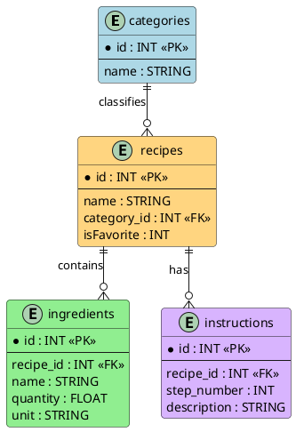
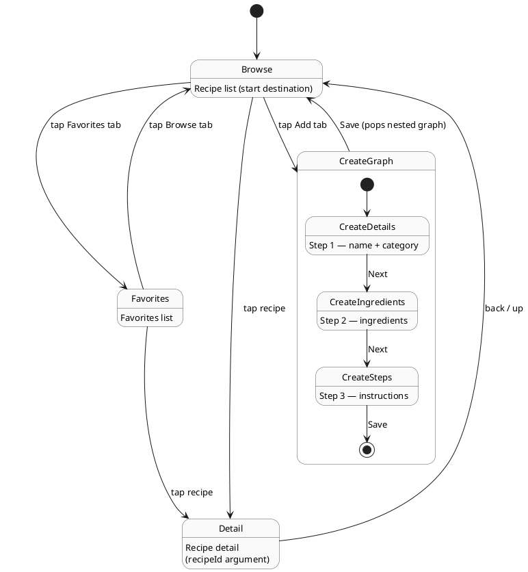

# Ingredients.inc - Recipe App

**Changing the world one bowl at a time**

## Database Schema

We are using 4 tables in this schema: Categories, Recipes, Ingredients and Instructions. The entity relationships are as follow

- Category-recipe: one-to-many    
- Recipe-ingredients: one-to-many
- Recipe-instructions: one-to-many

The following is the PlantUML code that provides the schema for the Database 

## Navigation Graph

The graph has four top-level destinations (Browse, Favorite, and the Create flow) plus a nested navigation graph that organizes the 3-step recipe creation flow. Ingredients and instructions are added by the user on separate screen within the nested graph, and a graph-scoped 'CreateRecipeViewModel' accumulates the in-progress recipe across all 3 screens.

The following plantUML graph shows a visual version of the graph

### Screens and their functions

**Browse** (`browse`) — The app's start destination. Lists all recipes grouped by category and serves as the entry point to both the recipe detail view and the create flow.

**Favorites** (`favorites`) — Lists only recipes the user has marked as favorite. Tapping any recipe navigates to its detail view. The user can return to the full recipe list at any time using the Browse tab.

**Detail** (`detail/{recipeId}`) — Shows a single recipe's category, ingredients, and instructions. The screen receives the `recipeId` as a navigation argument and supports toggling the recipe's favorite status without deleting the recipe itself.

**Create Recipe — Step 1: Details** (`create/details`) — First step of the nested create flow. Captures the recipe name and category.

**Create Recipe — Step 2: Ingredients** (`create/ingredients`) — Second step of the nested create flow. Captures the ingredient list, where each ingredient has a name, quantity, and unit.

**Create Recipe — Step 3: Instructions** (`create/steps`) — Third step of the nested create flow. Captures cooking instructions, then commits the saved recipe to the database via `RecipeViewModel` and exits the nested graph back to Browse.

The parent route of the nested create flow is `create_graph`. The user enters it by tapping the Add tab and exits it on Save, which pops the entire nested graph in a single operation and clears the graph-scoped `CreateRecipeViewModel`.

