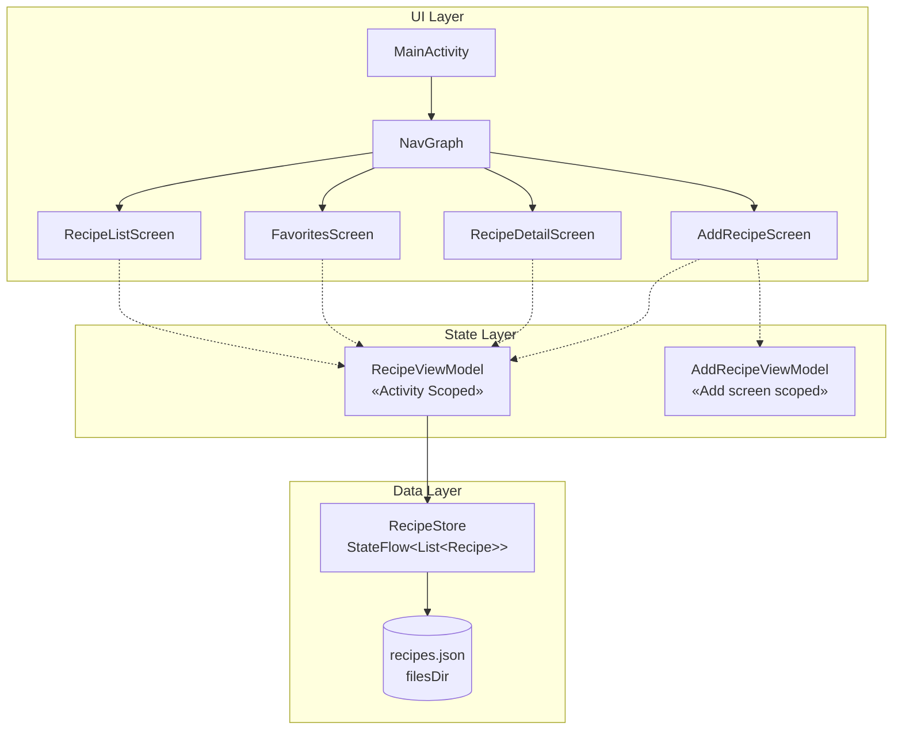
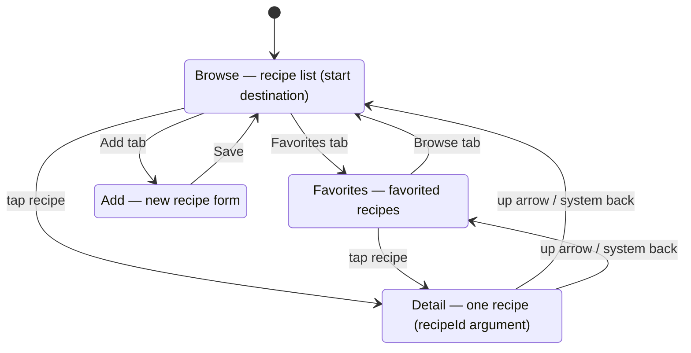

# Ingredients.inc — Recipe App

**Changing the world one bowl at a time**

A single-module Jetpack Compose app for keeping recipes. No database, no DI framework, no
annotation processors — the whole library lives in one JSON file.

## Project structure

```
com/ingridientsinc/recipe/
  MainActivity.kt          app shell, NavigationSuiteScaffold, window insets
  Model.kt                 Recipe, Ingredient, CATEGORIES, UNITS
  RecipeStore.kt           JSON file + StateFlow + first-run seed
  RecipeViewModel.kt
  AddRecipeViewModel.kt    add-form state
  navigation/NavGraph.kt   four flat routes
  ui/RecipeListScreen.kt   Browse, Favorites and the shared RecipeItem
  ui/RecipeDetailScreen.kt
  ui/AddRecipeScreen.kt
  ui/Components.kt         shared field colors, section headers, numbered rows
  ui/theme/                Color, Theme, Type
```

## Architecture



| Component | Type | Function |
|-----------|------|----------|
| MainActivity | Entry point | Hosts the NavigationSuiteScaffold and NavGraph; applies window insets once for every screen. |
| NavGraph | Navigation | Four flat routes: `browse`, `favorites`, `add`, `detail/{recipeId}`. |
| RecipeListScreen | UI | All recipes grouped by category, with inline favorite toggling. |
| FavoritesScreen | UI | The favorited subset, with an empty state. |
| RecipeDetailScreen | UI | One recipe: category, ingredients, instructions, favorite toggle, and an up arrow back to whichever list it was opened from. |
| AddRecipeScreen | UI | Name, category, ingredients and steps on one scrollable form. |
| RecipeViewModel | ViewModel | Exposes `recipes` and owns the coroutine scope for writes, so a save is not cancelled when a composable leaves the composition. |
| AddRecipeViewModel | ViewModel | Add-form state; scoped to the add nav entry, so it survives rotation. |
| RecipeStore | Data | `StateFlow<List<Recipe>>` backed by one JSON file. The single source of truth. |

Screens filter and group `recipes` themselves — there are no derived flows in the
ViewModel, because each one is a single line at the call site.

## Data

One nested model, no tables and no joins:

```kotlin
data class Recipe(
    val id: Long,
    val name: String,
    val category: String,
    val isFavorite: Boolean = false,
    val ingredients: List<Ingredient> = emptyList(),
    val instructions: List<String> = emptyList(),
)

data class Ingredient(val name: String, val quantity: Float, val unit: String)
```

Persisted to `filesDir/recipes.json` via `org.json`, which ships in `android.jar` — no
serialization dependency and no compiler plugin to keep version-aligned. On first launch
the store writes two sample recipes; a corrupt or truncated file falls back to that seed
rather than crashing at startup.

`RecipeStore` is the seam if this ever needs a real database: swap `encode`/`decode` for
Room and nothing above it changes.

Categories are defined once, in `Model.kt`. The dropdown, the browse grouping and the seed
all read the same list.

## Navigation



All three tabs go through one `switchTab` helper that pops to the start destination with
`saveState`, so switching tabs never stacks duplicate destinations and each tab keeps its
own scroll position.

Detail is the only pushed destination, and the only one with an up arrow. It calls
`popBackStack()`, so it returns to whichever list opened it rather than a hardcoded
destination — open a recipe from Favorites and up goes back to Favorites.

## Dependencies

Compose (via BOM), navigation-compose, lifecycle, and material-icons-extended. That is the
whole list — everything else is the Android platform.

Deliberately not here:

| Not used | Why |
|---|---|
| Room / SQLite | One JSON file covers a personal recipe list. `RecipeStore` is the swap point if that changes. |
| Hilt / Dagger | Two ViewModels and one store. `viewModel { }` initializers and a single process-wide `recipeStore(context)` do the job without an annotation processor. |
| kotlinx.serialization | Needs a compiler plugin version-matched to Kotlin, and AGP 9 bundles Kotlin at an unstated version. `org.json` ships in `android.jar` and sidesteps that entirely. |

There are no KSP or kapt steps in the build — nothing generates code.

## Build and run

```bash
./gradlew :app:testDebugUnitTest :app:assembleDebug
```

```bash
./gradlew :app:installDebug
```

Unit tests cover the JSON codec round trip and its corrupt-input fallback — the only
non-trivial logic in the data layer.
