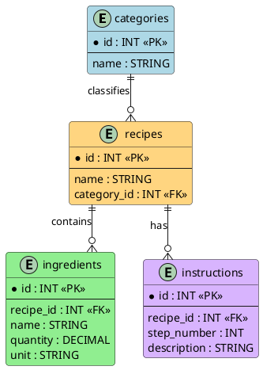

# Database ERD + Schema 

```plantuml
@startuml Recipe Management Data Model

skinparam linetype ortho
skinparam roundcorner 8
skinparam entity {
  BackgroundColor white
  BorderColor #555
  FontSize 13
}

entity "categories" as categories #LightBlue {
  * id : INT <<PK>>
  --
  name : STRING
}

entity "recipes" as recipes #FFD580 {
  * id : INT <<PK>>
  --
  name : STRING
  category_id : INT <<FK>>
}

entity "ingredients" as ingredients #90EE90 {
  * id : INT <<PK>>
  --
  recipe_id : INT <<FK>>
  name : STRING
  quantity : DECIMAL
  unit : STRING
}

entity "instructions" as instructions #D8B4FE {
  * id : INT <<PK>>
  --
  recipe_id : INT <<FK>>
  step_number : INT
  description : STRING
}

categories ||--o{ recipes : "classifies"
recipes ||--o{ ingredients : "contains"
recipes ||--o{ instructions : "has"

@enduml
```